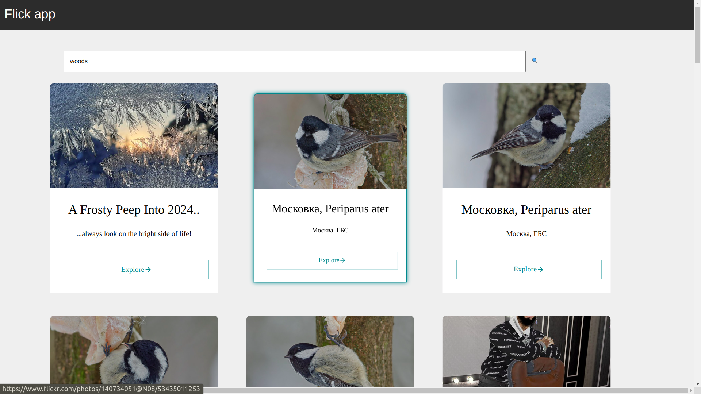

# Getting Started with Create React App

This project was bootstrapped with [Create React App](https://github.com/facebook/create-react-app).

## Flicker App
This project is a Frontend system implemented in React with  TypeScript to handle to  demonstate  to set up a React App, load in some photos from Flickr (JSON format) [public API](https://api.flickr.com/services/feeds/photos_public.gne?format=json) and display the photo, name and description in a card layout. The images should be clickable and link to the content. The app should have a header and a footer and ideally be responsive.

## Prerequisites

Make sure you have latest version of Node.js and npm installed on your machine.

- Node.js: [https://nodejs.org/]
- npm: [https://www.npmjs.com/]

## File Structure For Frontend
```
frontend
src/
|-- components/
|   |-- hooks/
|       |-- useFetch.tsx
|       |-- useLoader.tsx
|       |-- useObserver.tsx
|
|   |-- cardGallery.tsx
|   |-- cards.tsx
|   |-- footer.tsx
|   |-- header.tsx
|   |-- search.tsx
|
|-- constants.ts
|-- App.tsx
|-- css/
|   |--main.css
```

## Installation for frontend

```bash
$ cd saidot-flickr-app
$ npm install 
```
##  How to start frontend

```bash
# development
$ npm start 
```

To verify that the application started sucecssfully in local navigate to http://localhost:3000 in your web browser.



